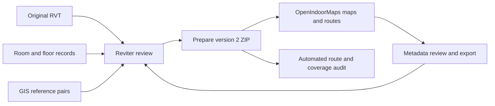
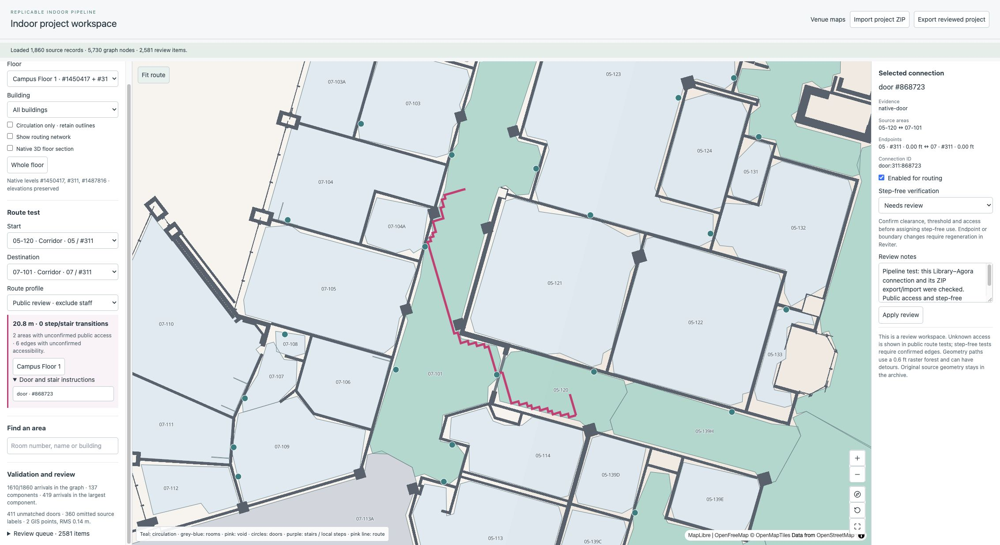
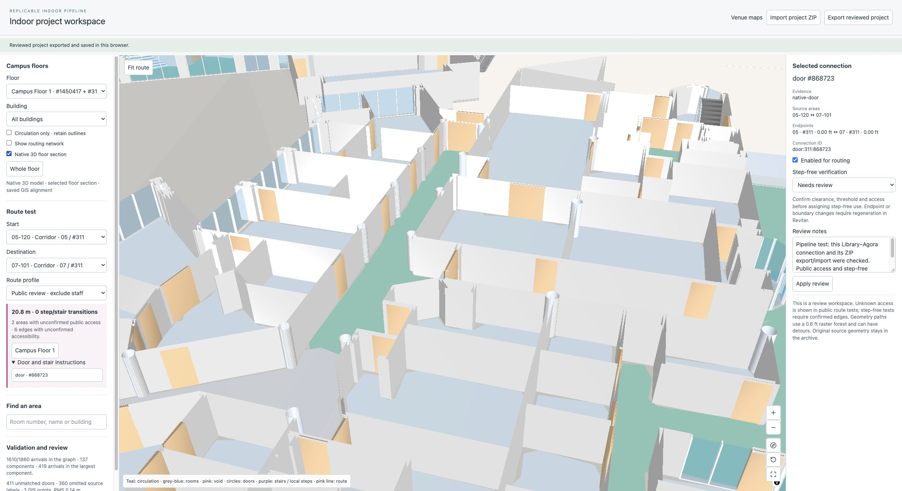
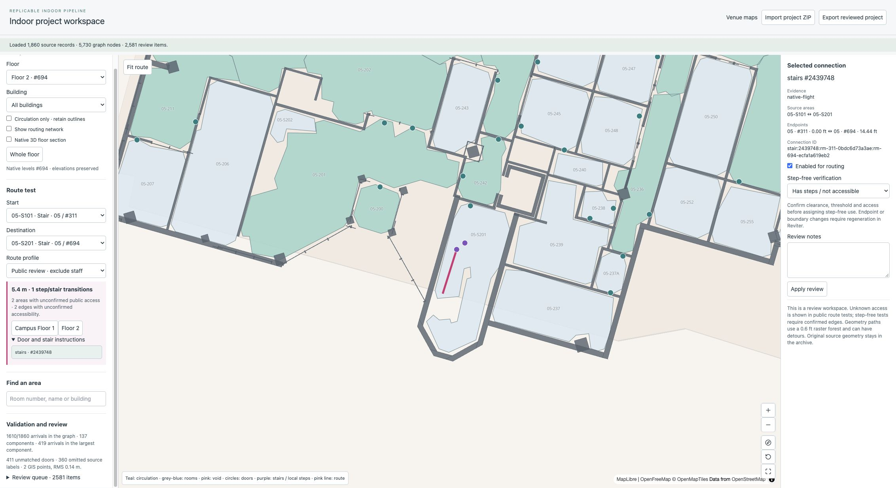

# Revit → reviewed indoor project → OpenIndoorMaps

This pipeline prepares a local, portable indoor project, opens it in OpenIndoorMaps, tests routes, saves metadata reviews, and regenerates the project after geometry corrections. It is suitable for review and development. A successful import does not mean every room or campus route is ready for public navigation.



## 1. Keep the three inputs together

For each model, retain:

1. The original RVT file, including its exact filename and Revit version.
2. The reviewed `reviter-room-annotations` JSON: source keys, room polygons and holes, room use, access, voids, doors, stairs, building transitions, campus storey groups, and drawing provenance.
3. WGS84 GIS reference pairs saved through Reviter. Model coordinates remain feet. Use at least two well-separated pairs; use a third independent point and points distributed across the campus to check alignment.

For a new model, a reviewed annotation JSON is an input prerequisite. This stage does not automatically create reliable room boundaries from any arbitrary RVT. Supply source records from a supported extraction/drawing workflow, register drawing walls when available, and review them in Reviter before preparing the project. Each active record needs a unique stable key, native `levelId`, model-feet polygon/holes and a consistent building identity. The existing directory resolves building identity from a `building-room` number prefix, then explicit `building`, then drawing section; normalize labels before import. Repeated room numbers are valid when their source keys differ.

Open the RVT and room JSON together in Reviter. Use **Floors → Building directory → Georeference model** to assign reference pairs. Save a project ZIP before preparing navigation. The ZIP preserves the original RVT bytes; it does not edit the source model.

If a newer room JSON has no georeference, the CLI below retains the exact references from the input ZIP. A different source-model filename is rejected. Do not substitute alignment from a different RVT revision without checking it.

## 2. Review geometry in Reviter

Before preparing a release, review each building and native level:

- Room/circulation polygons follow usable floor boundaries, including interior holes and open-to-below areas.
- Shared circulation classification identifies genuinely open areas. Preserve enclosed offices, storage, washrooms and staff restrictions.
- Doors identify their two source areas and have supported opening geometry. A reported relationship alone does not create a connection.
- Stair assemblies match actual lower and upper entrances. Local steps within a campus storey retain their native elevations; a whole stair room is not automatically a floor-to-floor connector.
- Inter-building doors and local-step transitions have supported entrances. An unassigned landing can become an explicit native landing surface when the saved transition verifies it.
- Group native levels into display storeys when appropriate. Grouping never creates graph links between coincident polygons.
- Review arrival points when drawing labels fall outside their polygons, on obstacles, or in a slab opening. Reviter's reviewed `routePointFeet` is separate from the original label.
- Inspect `sourceCoverage`: omitted drawing labels stay reported rather than being counted as imported areas.

Use the existing Reviter area, door, stair, boundary and picked-location tools for geometry corrections. Export the reviewed room JSON or project ZIP after changes.

## 3. Prepare a portable project

### Browser workflow

In **Floors → Building directory**, click **Prepare OpenIndoorMaps project**. At least two GIS pairs are required. A worker checks barriers, prepares navigation, exports a recovered GLB scene, and downloads a version 2 `.reviter.zip`.

**Export project ZIP** remains the lighter archive-only operation. Version 1 archives can reopen in Reviter, but must be prepared before OpenIndoorMaps can route them.

### Repeatable CLI workflow

Run from the Reviter repository with Node 22.13 or newer:

```sh
npm ci
npm run indoor:prepare -- \
  --input /absolute/path/source.reviter.zip \
  --rooms /absolute/path/latest-room-reviews.json \
  --out /absolute/path/prepared.reviter.zip \
  --revit-version 2027
```

`--rooms` is optional: without it, the saved package reviews are used. `--revit-version` is optional: without it, the converter uses its normal version detection. `--no-scene` produces a smaller map/routing project with no GLB. The CLI writes a separate `<output>.report.json` containing provenance, alignment, floor groups, coverage and review issues. Unsupported or insufficient native geometry causes preparation to fail rather than generating guessed connections.

For the current UNBC source, the command used was:

```sh
npm run indoor:prepare -- \
  --input '/Users/ahmadjalil/Downloads/UNBC Model - 2026-06-30 - FINAL (Fixed Library) (1).reviter.zip' \
  --rooms '/Users/ahmadjalil/Downloads/rooms.public-circulation-reviewed.json' \
  --out work/indoor-pipeline/UNBC.prepared.reviter.zip \
  --revit-version 2027
```

The source archive and review JSON are unchanged. The newer JSON is merged with the archive's two exact GIS pairs. No synthetic survey point is added.

### Optional walking-guide compilation

After the normal Reviter preparation, OpenIndoorMaps can compile reusable native walking segments into the prepared ZIP. Run from the OpenIndoorMaps repository:

```sh
npm run indoor:prepare-routing -- /absolute/prepared.reviter.zip /absolute/routing-prepared.reviter.zip
```

Import that output for runtime routing. The additional compiler preserves every model, GLB, room-review and GIS asset byte; it replaces only derived indoor JSON and its manifest checksum. It adds no graph connections and retains doors, restrictions and physical floor transitions. A source/access/door edit invalidates its cache; the viewer uses the existing resolver until compilation is rerun. Step-free routes retain their existing accessibility proofs. Reviter's preparation button does not automatically run this optional postprocessing step.

See [Prepared walking guides](../../openindoormaps/docs/prepared-walking-guides.md) in the sibling OpenIndoorMaps checkout for compilation reports and repeatable multifloor/clearance/browser checks.

## 4. Open and test in OpenIndoorMaps

From the OpenIndoorMaps repository:

```sh
npm ci
npm run dev -- --port 5174 --strictPort
```

Open **Prepared indoor projects** under **Revit Imports** on the welcome screen, or go directly to `http://localhost:5174/projects/indoor`, then click **Import project ZIP**. Import the prepared ZIP, not the RVT alone. The importer verifies all manifest sizes and SHA-256 digests, source binding, GIS agreement, and graph identities before use. The existing static venue maps retain their own datasets.

1. Select a campus floor, then **All buildings** or one building.
2. Use **Whole floor** to reset framing. Scroll/drag and the map controls provide normal map navigation.
3. **Circulation only · retain outlines** hides non-circulation fill while retaining source outlines and architectural walls. **Show routing network** draws the prepared walk graph.
4. Click an area or search by room number/name. The inspector shows its source key, building, native level, surface height, slab evidence, arrival status and preserved model relationships.
5. Select **Use as start / destination**, or use the route dropdowns. **Fit route** frames the result. Floor buttons show each campus storey visited by the route.
6. Click a door/stair marker or an instruction entry to inspect native identity, source evidence, endpoint areas and levels. Unmatched doors remain in the review queue; they do not become routing edges.
7. Toggle **Native 3D floor section** to see the recovered model and reviewed room/circulation colors on the same GIS alignment. The selected storey's lowest floor surface is the display datum. Source vertical feet and split elevations are retained; no surveyed absolute altitude or terrain model is assigned.
8. Test **Public review · exclude staff** and **Step-free · confirmed edges only**. A failed route is useful evidence; inspect its entrances and source boundaries.

Browser storage restores the most recently imported/exported project at the same origin. Unsaved reviews remain in memory until export. Storage failure is reported; the downloaded ZIP is the portable backup.

## 5. Assign metadata and preserve reviews

| Review | Where to assign it | Effect |
| --- | --- | --- |
| Display name and review notes | OpenIndoorMaps area inspector | Keeps the original source label and geometry; saves a presentation override |
| Public / staff / unknown access | Area inspector | Recalculates routes immediately; staff areas are excluded |
| Block an area as a void/unwalkable | Area inspector | Removes it from route use; restoring previously blocked geometry requires regeneration |
| Close or disable a supported connection | Connection inspector | Recalculates routes immediately |
| Confirm step-free passage | Connection inspector | Makes a supported non-step edge eligible for step-free routing; check clearance, thresholds and access |
| Arrival point, polygons/holes, area use, door sides, native stair entrances, local steps, building transitions | Reviter's review tools and source JSON | Requires preparation again; never creates an unvalidated shortcut in OpenIndoorMaps |
| New elevator/ramp or an entrance with missing native evidence | Source model/review workflow and compiler extension | Not inferred automatically by the current stair/door pipeline |

Click **Apply review**, then **Export reviewed project**, then the visible **Download reviewed ZIP** link. Preparing the ZIP also saves it in this browser. The download includes the original RVT, GIS pairs, source JSON, metadata overrides, prepared map/graph and optional GLB. Floor and graph hashes are regenerated. Import that ZIP again to verify the result. The link remains available until another review/import or page reload; if it disappears, export again.

For geometry corrections, open the reviewed ZIP in Reviter, fix the source records/entrances, then prepare it again. The CLI can also take the reviewed ZIP directly. Display-name overrides do not change circulation classification. Accessibility confirmations are tied to the exact model digest and endpoint geometry; changed geometry requires rechecking them. Steps cannot be marked step-free.

## 6. Automated validation for another model

Reviter checks:

```sh
node --experimental-strip-types --test \
  tests/indoor-grid.test.ts tests/indoor-pipeline.test.ts \
  tests/project-package.test.ts tests/georeference.test.ts \
  tests/room-directory.test.ts tests/directory-navigation.test.ts \
  tests/directory-openings.test.ts
npx tsc --project tsconfig.indoor-pipeline.json
npm run build:pages
```

OpenIndoorMaps checks:

```sh
npm run test:indoor
npx tsc --project tsconfig.indoor-project.json
npm run build
npm run indoor:audit -- /absolute/path/prepared.reviter.zip \
  --cases /absolute/path/route-cases.json \
  --out /absolute/path/validation.json
```

Route cases are data, not hard-coded building logic:

```json
[
  {"name":"Known public connection",
   "start":{"number":"A-101","levelId":100},
   "end":{"number":"B-102","levelId":100},"expect":"route"},
  {"name":"Known void is blocked",
   "start":{"key":"stable-source-start"},
   "end":{"key":"stable-source-void"},"expect":"blocked"},
  {"name":"Entrance under review",
   "start":{"number":"A-103","levelId":100},
   "end":{"number":"A-104","levelId":100},"expect":"review"}
]
```

`route` and `blocked` cases fail the command when expectations are violated. `review` cases record current behavior without turning an unresolved connection into an accepted route. Omitting `--cases` runs structural/registration checks and a supported-route restriction round-trip when such a pair exists. Use source keys where room numbers are duplicated. The current UNBC cases are in OpenIndoorMaps `tests/fixtures/unbc-indoor-routes.json`.

Tests cover thin native walls, holes, staff masks, precise openings, stable IDs, coincident floors, room shortcut prevention, step-free confirmation, stale accessibility reviews, package damage and model/GIS preservation across export/import. For release, also walk representative routes in the real building and review access, clearances and the GIS registration independently.

## 7. Package and graph contract

Version 2 is additive to the version 1 archive:

```text
manifest.json                 version, createdAt, entry paths/sizes/SHA-256
model/<original filename>     unchanged RVT/RFA/RTE/RFT bytes
floors/rooms.json              complete source records/reviews/provenance
gis/reference-points.json     exact saved WGS84 reference pairs
viewer/indoor.json            prepared floor catalog, areas, graph and report
model/scene.glb               optional recovered 3D scene
```

Entry names are allowlisted; duplicate, unlisted and oversized entries are rejected. Limits: source 512 MiB, room JSON 64 MiB, GIS 1 MiB, indoor data 128 MiB, GLB 256 MiB, whole ZIP/expanded content 900 MiB. Map tiles and separate Reviter camera/comment/markup sidecars are outside the package.

`reviter-indoor` version 1 contains:

- Source filename and model/room digests.
- Model-origin feet, WGS84 origin, projection latitude, rotation, horizontal metres/foot and independent vertical conversion of 0.3048 metres/foot.
- Display floor groups plus unchanged native levels.
- Source-keyed area records, polygon rings, elevation evidence, access/use and arrival IDs.
- Nodes identified by strings and by building/native level/surface. Shared XY coordinates cannot implicitly join them.
- Edges for walks, precise doors/registered openings, matched stairs and native-supported local steps. Evidence, native ID, room masks, enabled status and accessibility are retained.
- Architectural footprints and a review/coverage report.

The compiler uses a four-neighbour 0.6 ft raster and tests complete movement segments against native walls, columns and floor-opening masks. Private rooms override overlapping circulation. The grid follows the dominant boundary direction of each circulation surface/room. Multi-source wavefronts connect neighbouring supported terminals; obstacle-tested orthogonal shortcuts remove raster stair-steps. Dijkstra finds the shortest path in the exported sparse graph. This is not a globally optimal continuous geometric pathfinder or a corridor-centre navigation mesh. Ordinary rooms cannot serve as shortcuts unless they are the chosen start/destination; stair areas can carry verified stair connections.

Public review routing excludes explicit staff/voids but allows unknown access with visible warnings. Step-free routing accepts only edges explicitly confirmed step-free. There is no automatic elevator inference, clearance certification, live door position, opening-hours enforcement, emergency routing or guarantee of complete campus coverage.

The schema is `lib/reviter/indoor-contract.ts` in Reviter and its consumer copy `app/indoor-project/contract.ts` in OpenIndoorMaps. Keep them synchronized when changing the contract and version migrations. Browser and CLI use the same compiler; existing OpenIndoorMaps venue routing is independent.

## 8. UNBC evidence and remaining source work

The current prepared example includes all 1,860 source/recovered records, two saved GIS pairs and the original RVT (SHA-256 `8c294549ee667ed7aba38f1f4f3a53514dae7544af97f0157ee8187dd8702178`). GIS fit RMS is about 0.14 m; two fitted points are not an independent survey accuracy check.

The initial graph has 5,730 nodes, 5,459 edges, 1,610 arrivals with graph connections, 137 components and 419 arrivals in the largest component. An arrival connected inside its room can still be disconnected from the campus network. Edge counts: 3,999 walk branches, 1,428 doors, four registered openings, 26 stairs, and two supported local-step transitions. There are 411 unmatched native doors and 360 omitted source labels.

Verified pilot behavior:

| Case | Result |
| --- | --- |
| 05-120, Library → 07-101, Agora, native level #311 | Route, approximately 20.8 m |
| 05-S101 #311 → 05-S201 #694 | Native stair route, approximately 5.4 m |
| 08-S101 #1487816 → 08-S201 #694 | Native stair route, approximately 8.8 m |
| 04-124 → 04-445 upper Rotunda void | Blocked |
| Staff restriction, export and reimport | Route remains blocked; model/GIS preserved |
| Map registration vs exported node coordinates | Agreement within floating-point precision |

05-142 → 07-203A, 07-180 → 08-155 and 07-203 → 09-214 remain review cases: native local transitions alone do not repair every adjoining source boundary/arrival. Resolve their missing entrances and polygons in Reviter before claiming continuous routes. Do not release the whole campus as fully connected on the strength of the small pilot.

Generated artifacts are in Reviter `work/indoor-pipeline/`: the prepared ZIP, preparation log, report, cross-app validation JSON, and interface screenshots. The audit reports coverage for every imported building/native-level pair. The [published validation snapshot](indoor-pipeline/unbc-validation.json) and screenshots under `docs/indoor-pipeline/` preserve the demonstrated evidence in the repository. Large RVT/ZIP files are local artifacts, not repository assets.

## 9. Demonstrated interface and handoff

The current example is also saved as `/Users/ahmadjalil/Downloads/UNBC.indoor.prepared.reviter.zip`. Start OpenIndoorMaps on port 5174 and open `/projects/indoor`. Import that file if browser storage is empty.

The browser walkthrough verified campus Floor 1, the 05-120 → 07-101 route and native Door #868723 inspector, the 05-S101 → 05-S201 route and Floor 2 button, and the native 3D floor section. A connection review note survived export to browser storage and reopening. Package export/import and staff restriction preservation were separately verified with the same package code against the full UNBC archive. The in-app browser automation did not return a disk-download event for the ZIP link, so an automated disk-download/reupload in that browser was not verified; the CLI-generated portable example is available at the path above.







The selected checks passed: 44 Reviter tests, eight OpenIndoorMaps tests, scoped TypeScript checks for both integrations, both production builds and the static Pages worker check. A full OpenIndoorMaps TypeScript run remains affected by existing optional-padding errors in `scripts/verify-bc-hospital-step-follow.ts`; it is not reported as a clean whole-repository check.

The subsequent Reviter pre-push check on October 1, 2026 passed the full unit suite (1,283 passed, one skipped), production build, four server-rendered interface checks, scoped pipeline TypeScript check, and static Pages build/worker check. The browser ZIP size preflight uses the same 900 MiB package limit as the parser.

For another building/model, repeat sections 1–6, supply that project's own route-case JSON, and retain its report alongside the prepared ZIP. Accept a navigation release only after resolving the relevant coverage gaps, verifying representative routes on site, confirming access/step-free metadata, and checking registration with an independent reference point. The 3D section is visual review context; use the 2D floor route for the current route display.


Hospital-style presentation and native entrances — October 1, 2026
-----------------------------------------------------------------

The pipeline now exports optional native `doors` display records in `viewer/indoor.json`. Each record retains native element/level identity, position, precise oriented footprint when recovered, candidate/source rooms and review state. This comes from the same `directoryDoors`/`directoryDoorReviews` evidence used by compilation; unmatched doors remain display/review objects and do not acquire graph links. The optional field is mirrored in both apps' indoor contracts, keeping older version-1 datasets importable.

Regenerated example: `/Users/ahmadjalil/Downloads/UNBC.indoor.hospital-style.reviter.zip`. It has 1,886 door positions and 1,883 recovered footprints, with the same graph and 411 unmatched-door report. Original model, room, GIS and GLB entry bytes match the earlier prepared ZIP.

OpenIndoorMaps offers **2D rooms**, **3D rooms** and **Source model**. The first two use hospital-style white flat corridors, solid low room blocks that include native wall thickness, and blue native apertures. Room blocks and walls share a display height, removing the raised perimeter shell around an inset volume. Room/wall/door display heights are illustrative; native units/elevations stay in the source data and model view. Amber entrances open source review details. Real upper polygon holes and explicitly reviewed open drops expose clipped lower-floor room context, without adding routing connectivity.

Three source polygons fail precise display subtraction and retain their original geometry; source-boundary cleanup remains necessary. The 411 unmatched doors, 360 omitted source labels and previously disconnected campus cases are unchanged by presentation work.


### Wall/column presentation and regenerated routing

`walls[].kind` distinguishes recovered native `wall` and `column` footprints. Both still block routing. OpenIndoorMaps hides columns by default in its room presentation, merges visible wall faces, continues straight walls at their own thickness through touching hidden column footprints, then cuts precise native door apertures. Source RVT/GLB remain unchanged and available in Source model mode. Legacy unclassified footprints require regeneration for the pillar toggle.

Regenerate the current UNBC example:

```sh
npm run indoor:prepare -- --input /Users/ahmadjalil/Downloads/UNBC.indoor.hospital-style.reviter.zip --out /Users/ahmadjalil/Downloads/UNBC.indoor.clean-routes.reviter.zip --revit-version 2027
```

This revision exports 4,809 nodes / 5,343 edges and 1,225 column footprints. Library–Agora is 17.484 m instead of 20.793 m, with 11 path vertices instead of 52. The 411 unmatched-door issues remain. Accessibility approvals remain geometry-bound and must be rechecked when paths change. Retain earlier ZIPs as source backups; importing/exporting alone does not recompile a saved routing graph.


### Continuous corridor centring in the receiving viewer

OpenIndoorMaps now resolves straight or single-elbow corridor paths after graph search. Native wall directions and corridor cross-sections replace grid stair-stepping and unused side-door visits when the complete candidate is covered by the selected source areas/doors and clears native walls, columns, holes and access masks. Only selected precise native door footprints cut walls. Unverified or complex candidates retain the saved path; confirmed step-free paths retain the geometry to which their approvals apply. Source graph IDs, stair transitions, native model and GIS data are unchanged.

The existing clean-routes ZIP now displays Library–Agora as 15.755 m, two centred straight legs and one 90° right turn (three vertices), versus its saved graph distance of 17.484 m. Independent native checks found zero barrier crossings. Refreshing the receiving viewer is sufficient for this change; recompilation is still required for corrections to source boundaries and connectivity. The 411 unmatched doors remain unresolved. OpenIndoorMaps evidence is in `docs/unbc-centered-route-audit.json` and `docs/unbc-centered-geometry-audit.json`; its 18 unit tests, desktop/mobile browser regressions, TypeScript check and production build passed.


### Visitor interface and routes with multiple corners

The receiving OpenIndoorMaps app now defaults to a hospital-style full-map visitor view. It reuses the BC Hospital preview cards and progress controls for source room routes, with responsive search/categories, room details, 2D/3D and floor selection. **Review project** exposes the existing source review/export workspace. Step instructions come from resolved route geometry; stepping through stairs focuses the correct native floor. No elevator or accessible link is inferred.

A continuous, obstacle-tested corridor-lane search extends the earlier single-elbow resolver. The current clean-routes ZIP demonstrates 05-120 → 05-165 as 68.589 m / three straight legs / two turns, and 05-120 → 05-S203 as a 58.585 m route into Floor 2 with the original stair geometry. The latter retains source walking geometry where a centred candidate cannot be validated. Source graph and package bytes remain unchanged; 411 unmatched doors still require source corrections. OpenIndoorMaps checks passed: 20 units, four desktop/mobile regressions, TypeScript, production build, and nine route cases. Its independent geometry report checked 37 centred segments from 18 longer examples with zero native wall/column crossings.

OpenIndoorMaps now derives display room boundaries from complete native wall enclosures where they match a source room identity, using actual recovered door footprints to close thresholds during discovery and cutting them out afterwards. Both 2D and 3D prefer these wall faces. Missing, invalid or ambiguous enclosures retain source polygons; no new room or route is inferred. The current clean-routes package supports 539 such room records, with 1,027 source fallbacks. Native source polygons, model/GIS bytes and graph approvals stay intact. Detailed before/after evidence is in OpenIndoorMaps `docs/unbc-wall-room-boundaries.json`.

OpenIndoorMaps also repairs display-only wall end-cap junction gaps up to 0.02 feet (6.1 mm) against another same-floor classified wall. The 05-107 Meeting / 05-108 WC / 05-109 Kitchen inset blocks were caused by roughly 3.8 mm gaps in exported wall junctions; these now resolve from actual wall faces and absorb adjoining wall material into their roofs. Door apertures and corridors stay open. Larger gaps and ambiguous boundaries still require source review. No package regeneration or graph changes are involved. The latest viewer validation passed 24 units, both prepared-room desktop/mobile cases, TypeScript, focused renderer lint and the production build.

### Room corner fidelity requires boundary preparation before export

Audit of the current clean-routes ZIP found 1,776 of 1,860 annotations with `source.polygon = "derived"`, versus only 76 marked `vector-walls`. The approximate region extractor traces grid-cell contours and simplifies them with a 0.7-cell tolerance (`derived-rooms.ts`); the indoor compiler copies annotation polygons directly to `records[].ringsFeet` (`indoor-pipeline.ts`). Thus recompiling the same annotation JSON preserves inset and chamfered corners. The receiving viewer's 539 recovered wall enclosures are a partial presentation repair, not a completed correction of the source room boundaries.

A diagnostic run of the existing registered-wall rebuild using all annotations in the two relevant Level 1 plan sections and prepared native door footprints rebuilt 33/110 records on `05 Libr LVL 1` and 36/102 on `07 Agora LVL 1C`. It corrected 05-139C Office but left 05-154 Classroom unresolved. The recovered Office outline also contains an arc from drawing linework. This does not validate blanket automatic use of the current survey rebuild: structural wall faces must be distinguished from leaf/swing symbols. No source annotations or graph/package bytes were changed by this probe. The existing six room-boundary unit checks passed, but their fixtures do not establish full-building fidelity.

The required next processing stage should construct structural wall-face topology per native floor, close only supported wall junctions and native door thresholds for cell discovery, assign labels to unambiguous enclosed cells, retain real floor holes and open corridors, and check corner-to-wall agreement. It must preserve stable room identities and expose unresolved cells rather than silently presenting approximate raster contours as exact room blocks. Verified presentation boundaries should be exported separately from source/routing polygons until reviewed geometry corrections have been recompiled and route/access approvals revalidated. Evidence: OpenIndoorMaps `docs/unbc-room-source-processing-audit.json`.


## Native wall room presentation (2026-10-01)

The pipeline now adds optional `presentation` geometry. Source `records[].ringsFeet`, room annotations, native geometry and graph remain separate. Model SHA and each source record's floor/polygon serialization bind prepared visual geometry to its source. Imports reject malformed, wrong-floor or stale presentation entries. Metadata review/export preserves valid presentation; marking a room nonwalkable removes its display block.

To add it to an existing prepared archive without re-reading the RVT:

```sh
cd /Users/ahmadjalil/github/reviter
npm run indoor:presentation -- --input /Users/ahmadjalil/Downloads/UNBC.indoor.clean-routes.reviter.zip --out /Users/ahmadjalil/Downloads/UNBC.indoor.native-wall-rooms.reviter.zip
```

Use a new output path. The CLI writes a companion `.presentation-report.json` and verifies source rooms, architectural records and graph are unchanged. Normal `indoor:prepare` also runs this stage.

UNBC: 889 verified native enclosures, 881 retained display blocks out of 1,566 eligible rooms. Eight recovered cells disappear after protected geometry subtraction and are reported instead of guessed. 685 rooms retain fallback display with diagnostics; missing partitions, unclosed cells and ambiguous labels still require source corrections. Viewer partial recovery may improve some fallbacks but does not replace this provenance.

Visitor 2D/3D now share the same block geometry; native doors remain gaps and review metadata, with door volumes hidden in visitor mode. Pillar visibility continues to affect presentation only. Original room holes and explicit open-drop areas remain protected. Lower-floor context is still clipped planar geometry, not a complete physically elevated floor stack.

Validation reports and primary-source research: `/Users/ahmadjalil/github/openindoormaps/docs/indoor-boundary-research.md`, `unbc-native-room-enclosure-audit.json`, `unbc-prepared-room-presentation-audit.json` and `unbc-wall-rooms-route-audit.json`. The geometry audit preserves RVT/scene/annotations/GIS bytes and graph, with no prepared-block overlap above 0.01 ft² against tested protected masks/apertures/holes/other blocks at 0.0001-ft precision.

Actual navigable interiors have **not** been replaced by visual wall-absorbing blocks. Correcting navigable interiors must regenerate native door matching, anchors, regional graph and geometry-bound approvals. The source still reports 411 unmatched doors; elevator/escalator connectors require explicit native or reviewed evidence and a richer contract. See the research document's prioritized work list.


Final validation for this change: 33 targeted Reviter unit tests and 31 OpenIndoorMaps unit tests passed. Four real-package desktop/mobile browser workflows passed, covering room geometry, common 2D/3D footprints, visitor door visibility, native pillar toggles, complex right-angle routing, stair floor-following/reversal, consecutive floor milestones and unconfirmed step-free rejection. Both production builds passed. OpenIndoorMaps scoped TypeScript and new geometry-module lint checks passed; Reviter's focused preparation-module TypeScript passed. Full Reviter TypeScript still reports pre-existing errors under `work/**` copies and audit scripts. The first development browser run was invalidated by hot reload; final browser validation ran on a fresh server with watching/HMR disabled.

## Hospital-style preparation upgrade: source interiors, floor depth and visitor information

The repeatable source correction command is now:

```sh
npm run indoor:prepare -- --input /Users/ahmadjalil/Downloads/UNBC.indoor.native-wall-rooms.reviter.zip --out /Users/ahmadjalil/Downloads/UNBC.indoor.hospital-parity.reviter.zip --revit-version 2027 --native-interiors
```

`--native-interiors` promotes only independently enclosed native interiors before rebuilding door matching, arrivals and every regional graph. It excludes stairs, ambiguous labels, stale geometry, unsupported anchors, significant native barrier overlap and protected circulation/open drops. Roof footprints never become navigation interiors. Original room rings and boundary element IDs remain in each promoted annotation's `nativeInteriorProvenance`; a companion `.boundary-promotion.json` reports exclusions. Use a new output path. Existing source model/GIS/scene are preserved, and geometry-bound accessibility approvals are revalidated during compilation.

Measured UNBC result: 866 interiors promoted, 1,639 routable arrivals (previously 1,610), 128 graph components (134), and 378 unmatched doors (411). The presentation stage still provides 881 blocks with 685 fallback diagnostics; promoting interior geometry does not recover missing partitions. These source cases remain visible in review. The all-room report identifies 1,611 public destinations with another destination reachable and 849 with a reachable destination on another native floor. Reachability counts are topology evidence, not individually inspected routes.

To import boundaries calculated by an actual Revit exporter, add `--semantic-boundaries /absolute/finish-boundaries.json` to `indoor:prepare`. This validates model identity, Finish-face convention, internal feet, native room/phase identity, floor elevation, topology, source labels, holes and native barriers, then regenerates the graph from accepted corrections. Rejected entries remain unchanged and receive a `.semantic-review.json`. The offline RVT parser cannot run Revit's semantic room API. Export requirements and an illustrative schema are in [room-boundary-preparation.md](room-boundary-preparation.md).

### Visitor information

Use `--visitor /absolute/visitor.json` during preparation, or update a prepared archive without recompiling geometry:

```sh
node --experimental-strip-types scripts/prepare-visitor-metadata.ts --input /Users/ahmadjalil/Downloads/UNBC.indoor.hospital-parity.reviter.zip --visitor /Users/ahmadjalil/github/openindoormaps/docs/unbc-visitor-metadata-example.json --out /Users/ahmadjalil/Downloads/UNBC.indoor.hospital-review.reviter.zip
```

The optional version-1 metadata has `buildings` keyed by source building ID (`name`, optional `shortName`) and `places` keyed by source room ID (`displayName`, `description`, `category`, `department`, hex `color`, `landmark`). Categories are study, food, washroom, department, entrance and other. Unknown IDs and malformed values are rejected. OpenIndoorMaps source review exposes an editor under **Visitor names, categories and colors**; export preserves these fields in `floors/rooms.json`, and Reviter carries them through subsequent preparation. Visitor names never rename native source rooms or alter access/geometry.

### Explicit vertical connections

`--connectors /absolute/connectors.json` imports version-1 model-bound connector review metadata into room annotations. Each elevator/escalator requires its exact native identity and explicit native entrance identities, served native floors, room anchors, evidence, direction and accessibility. Entrance elements must actually relate to those native floors. Escalators require one direction and cannot be marked step-free. Elevators may serve several explicit floors; a passing shaft does not add stops. Incorrect evidence produces review issues without adding graph links. No elevators/escalators have been fabricated for UNBC. Existing stairs remain native-supported.

### Rendering and validation limits

The receiving viewer renders consistent 0.6 m room roofs, open halls, hidden visitor door volumes, lighter exposed wall material and the same prepared footprints in 2D/3D. Genuine upper openings show prepared lower rooms/walls at measured negative elevations, masked in perspective to their actual aperture. Column recesses do not become floor openings. 3D room labels are projected above their roofs; native symbols remain in 2D. Named buildings, badge sizing and curated visitor information feed search, cards and the floor picker. An outdoors selector requires exterior data and is not invented for this package.

The compiler's turn/clearance preference and continuous native-barrier checks improve path shape, but raster clearance is not measured accessibility certification. An independent 44-case direction/profile comparison retained all route availability outcomes; 72 final walking segments had zero native wall/column crossings. A stair-approach case improves from an intermediate 14 turns / 59.30 m to 8 turns / 54.87 m; the older source remains 7 turns / 52.15 m, so exact route parity is not claimed. Real floor openings, remaining partitions, door relationships, clearances and confirmed accessible approaches still require source evidence/review.

Reports in OpenIndoorMaps: `docs/unbc-hospital-navigation-upgrade-audit.json`, `docs/unbc-hospital-all-room-routing-audit.json`, `docs/unbc-native-promotion-audit.json` and `docs/unbc-boundary-coverage-audit.json`.

Final upgrade verification: 50 targeted Reviter tests and 50 OpenIndoorMaps tests passed, alongside both scoped typechecks and production builds. Four real-package desktop/mobile workflows passed, including multi-turn paths, three-floor stair journeys, reversed travel and 2D/3D switching. Two additional desktop/mobile browser tests use an explicitly synthetic two-floor package to verify actual lower-room pixels in both 2D/3D, their disappearance when the custom layer is removed, visible roof labels and exclusion of native column recesses. These aperture tests verify the renderer; they do not establish missing UNBC lower-floor coverage. Screenshot evidence is in OpenIndoorMaps `docs/screenshots/unbc-hospital-review-desktop.jpg` and `synthetic-floor-openings-mobile-3d.png`.

Next source work is concentrated on the 685 fallback presentation records and 378 unmatched doors. Export semantic Finish boundaries with native room/phase identity from Revit; correct missing partitions and ambiguous labels rather than expanding blocks blindly. Review actual native door-to-room/floor relationships, then regenerate matching and routes. Export verified elevator entrances, served floors and accessibility evidence before enabling lift navigation. Review curated public names/categories/colors across remaining buildings. Saved semantic provenance is revalidated on every normal preparation, so the sidecar need not be reattached when its accepted geometry and model identity remain current.


## Local wall-joint recovery and exhaustive floor review (2026-10-02)

This stage reconstructs visitor rooms without requiring authored Revit Rooms.
The original RVT, scene and GIS references remain unchanged. Supported repairs
are derived geometry with native element IDs, gap distances and polygons in
`docs/unbc-native-junction-repair-review.json`; they are not edits to the RVT.

A rectangular wall end cap may bridge at most 0.08 ft (24.4 mm) to an actual
recovered wall or column. A single corner wedge is limited to 0.04 ft (12.2 mm).
Modeled doors exclude repair patches. No room annotation creates a partition,
and nearby parallel wall faces cannot justify closing an unrelated gap.
The normal local wall-face graph remains preferred. Unclosed candidates retry
the complete native floor's barrier union, with actual column islands removed
from free cells. Acceptance still requires a unique label, substantial source
overlap and no protected circulation, source hole or wall-material conflict.

The screenshot's 05-122 Studio is now enclosed by native wall IDs 807017,
807021, 807025, 807929 and 866754 with column 1577221. Small supported seams
replace the former cut-off drawing corners. Physically touching column
material may join its roof; detached hallway pillars do not become room roofs.
The 05-107 Meeting / 05-108 WC shared enclosure remains contested: no
verified partition separates their labels, so neither receives an invented
interior. Open stair areas are counted separately from ordinary room failures.

Native source inspection found two independently identified ProjectPhase
instances (12589, 86961) and no complete RoomElem, Room or RoomTag instances
in the supported scan. The scan covered all 3,666 inflated partition pages
without failed pages, but only complete in-page frames of 40–65,535 bytes.
It supports the account that authored Rooms are absent; it does not certify
absence from larger or cross-page carriers. Phases already exist. Evidence:
`docs/unbc-native-room-phase-instance-audit.json`.

Navigation preparation validates entire walking segments against source floor
coverage, holes, native barriers and derived joint patches, including gaps
smaller than a raster cell. Separate doorway apertures cannot collectively
authorize a tunnel through wall material. The viewer prefers fewer turns
within its distance budget, retaining source stair flights and checked source
geometry wherever a safe centered replacement cannot be established. This
can remove a shortcut and increase route distance or split a graph component.

Remaining source cases are itemized by room and native element in
`docs/unbc-source-model-repair-inventory.json` and
`docs/unbc-door-lift-source-review.json`. Curtain wall parents normally
delegate their surfaces to panels/mullions; their missing parent footprint is
not evidence of a missing partition. The wall with undecoded native floor
association is already included where its exact solid intersects the prepared
cut elevations. Lift labels and machine rooms do not establish served stops.

For future Windows/Revit access, `tools/revit-semantic-export/` contains a
read-only Revit 2027 exporter source and `scripts/map-revit-finish-inventory.ts`
requires an explicit native Room/phase-to-annotation mapping before import.
The C# add-in has not been compiled or executed on this Mac. Local room
recovery does not depend on that tool. See
[room-boundary-preparation.md](room-boundary-preparation.md) for its contracts.

### Final local package and measured coverage

The current package is
`/Users/ahmadjalil/Downloads/UNBC.indoor.local-repaired.reviter.zip`. Reproduce it
from the preceding source review archive:

```sh
node --experimental-strip-types scripts/prepare-indoor-project.ts --input /Users/ahmadjalil/Downloads/UNBC.indoor.hospital-review.reviter.zip --out /absolute/new-output.reviter.zip --revit-version 2027 --native-interiors
```

The final package contains 1,042 prepared blocks (881 previously), with 161
added and no old verified block lost. Strict promotion accepts 1,026 interiors
(866 previously). Sixteen recovered enclosures remain unsuitable for navigation
promotion: 11 stair areas, three native-barrier conflicts and two protected
floor conflicts. Source RVT, scene, GIS and native wall arrays are unchanged.

Of 1,500 ordinary room candidates, 1,031 have prepared blocks and 469 remain
source fallbacks: 230 lack a verified closed enclosure even with full-floor
geometry, 233 fail source-overlap ownership checks, five explicitly share an
enclosure, and one has no local native walls. Separately, 55 of 66 stair areas
remain open/unresolved. The historical 685 count therefore becomes 524 total
fallbacks, including those stair areas. No partitions or lift stops are invented.

The compiler reports 1,647 arrivals, 142 components and 351 unmatched doors
(previously 1,639, 128 and 378). Safer continuous floor checks remove unsupported
shortcuts; higher component count is not claimed as improved connectivity.

Independent final walking proof checks all 3,919 enabled walking edges and
8,354 segments with zero native/derived-joint crossings or unsupported-floor
intervals. Separate walking-plus-door proof checks 5,406 edges and 9,841
segments with zero failures; door coverage includes the approved side-anchor
envelope at native clear width, not a physical floor or clearance survey.
The 36 concrete directional cases retain all 28 available outcomes and have
582 realized flat segments with zero native/derived-joint crossings. Remaining
complex journeys may keep multiple bends or safe source geometry.

Evidence in OpenIndoorMaps: `docs/unbc-local-repair-presentation-audit.json`,
`docs/unbc-local-repair-walking-audit.json`,
`docs/unbc-local-repair-door-audit.json`,
`docs/unbc-local-repair-complex-audit.json` and
`docs/unbc-local-repair-room-topology.json`. Topology counts do not certify
individually driven routes. UNBC has no confirmed step-free graph or decoded
lift assembly with verified served-floor entrances.

The earlier `08-161` → `10-4588` demonstration now stops at source review:
08-161 has no safe prepared doorway anchor within the native jamb width and
snap limit. Its coarse outline reaches only a 0.022-ft slice of that width;
the recovered native cell is much larger (99% source coverage but only 8.3%
cell coverage), so it cannot establish an independent classroom partition.
A finer grid alone cannot provide reliable source-supported entry. This is a
reported source limitation, not a passing route. The verified three-flight
browser journey uses `10-1018` → `10-4018`, then its reverse.

Validation for this package: 71 targeted Reviter tests and both source/viewer
scoped TypeScript checks and production builds pass. Final saved walking/door
geometry reports are exhaustive for their stated scopes; complex route cases
are a concrete directional sample. The C# Revit add-in remains source-only.

Final shared-column rendering assigns only actual native column material inside
each touching roof's perimeter continuation. Competing claims remain neutral;
room-key order cannot give one room the entire column. Existing wall roofs,
door gaps, circulation and genuine floor openings remain protected. The actual
Studio fixture and rotated two-room/key-order regressions cover this behavior.
The final targeted suite passes 71 Reviter and 64 OpenIndoorMaps tests, with
both scoped typechecks and production builds passing. Desktop/mobile Studio
proofs are `docs/screenshots/unbc-joint-repaired-studio-desktop.png` and
`unbc-joint-repaired-studio-mobile.png` in OpenIndoorMaps. The retained live
preview screenshot is `docs/screenshots/unbc-local-repaired-studio-preview.png`.

### October 2: locally recovered doorless entrances

The current working package is `/Users/ahmadjalil/Downloads/UNBC.indoor.open-fronts.reviter.zip`. Reproduce the incremental entrance correction while retaining the existing source promotions:

```sh
node --experimental-strip-types scripts/prepare-indoor-project.ts --input /Users/ahmadjalil/Downloads/UNBC.indoor.local-repaired.reviter.zip --out /absolute/new-output.reviter.zip --revit-version 2027
```

`registered-open-fronts.ts` handles ordinary endpoints with no matched entrance. It requires an adjacent circulation area in the same registered drawing section, registration residual at most 0.05 feet, a raster seam at most 0.75 feet, full native-floor coverage of a two-foot swept footprint, and no overlap with native/repaired walls, columns, drawing walls, third-room footprints or recorded holes. Invalid polygon operations reject the candidate. It retains unknown access/accessibility and exports distinct recovered-source evidence, without fabricating a native door or a human-reviewed opening.

Library Services Desk `05-136` reaches `05-137 Open Area` across a 0.038095-foot source seam between native counter/wall elements 2438907 and 2438956. The whole 2.076190-square-foot swept region has native-floor support. Five other source-supported endpoints also recover. The regenerated archive has 1,653 arrivals (six more), 4,922 nodes, 5,460 edges, 142 components and 351 unmatched doors. Original room JSON, RVT, scene and GIS bytes are unchanged; 1,042 prepared blocks and 524 unresolved room/stair outlines remain. This is a partial campus map, not a completed navigation release.

OpenIndoorMaps additionally clips unresolved display roofs to native wall material and removes detached fragments. This corrects the desk's striped rendering without marking its approximate outline as a verified enclosure. Its seven-case route report, independent six-opening proof, exhaustive saved walking/door checks, and current every-destination topology are under OpenIndoorMaps `docs/unbc-library-desk-route-audit.json` and `docs/unbc-open-fronts-*.json`.

#### Architectural footprint quality in the portable viewer

Prepared wall/column records now preserve the architectural plan's `approximate`
flag. This describes the display footprint; it never removes a routing barrier.
OpenIndoorMaps omits broad bounds-only wall envelopes from visitor extrusions,
while source review retains them. Native wall #948595 at UNBC was such an
unverified envelope, rather than a room-sized wall face.

For an existing prepared archive and its matching local conversion cache,
`scripts/mark-indoor-wall-quality.ts input.zip native-cache.json output.zip`
can add this metadata. It matches native element ID, level and the exact rounded
polygon before copying the flag, refreshes the viewer manifest hash and leaves
model/GIS/floor/scene entries and routing records intact. This operation does not
repair the original Revit wall or calculate a new room interior.


Native stair display export (2026-10-02): preparation now exports complete native tread projections separately from source room/routing boundaries, including curved flights outside approximate DWG stair outlines. Matches require a physical flight endpoint within 1 ft of the recovered room surface and actual tread polygon overlap. Equally overlapping source stair owners are not assigned. `node --experimental-strip-types scripts/prepare-stair-display.ts input.reviter.zip new-output.reviter.zip` adds this optional display data to an existing prepared project without recomputing its graph. OpenIndoorMaps validates model and source geometry bindings and does not authorize routes through these display projections.


### October 2: deep-host native doorway orientation

Preparation now preserves each native door's original unit normal through `RouteOpening.normal`, `GridTerminal.nativeDoorNormal` and optional portable `doors[].normalFeet`. A host-expanded threshold can be deeper than its native clear width; its longest rectangle side therefore cannot reliably identify the jamb axis. Grid snapping uses the axis perpendicular to the native normal while retaining all room containment, jamb width, native barrier and maximum snap constraints. The viewer uses the same exported direction for aperture coverage and implicit doorway access/direction dependencies. Legacy records without normals keep the existing inference.

`/Users/ahmadjalil/Downloads/UNBC.indoor.door-axis.reviter.zip` was regenerated from the native-stairs package with the exact model-bound decoded native geometry. Model, original room JSON, scene and GIS bytes are preserved. Five previously rejected native doorway links recover, including the missing 03-S303 stair arrival. There are now 1,654 prepared arrivals, 1,621 public connected destinations and 772 destinations with other-floor routes; 847 additional unique destination pairs are reachable. The unresolved source/access inventory remains explicit: 201 missing entrances and 33 public-isolated arrivals.

From Reviter, normal preparation includes this change:

```sh
node --experimental-strip-types scripts/prepare-indoor-project.ts --input /absolute/source.reviter.zip --out /absolute/new-output.reviter.zip --revit-version 2027
```

OpenIndoorMaps `scripts/indoor/audit-native-door-axis.ts` checks a before/after package and matching model-bound native cache, preserves all source assets, exercises every newly recovered native door in both directions, checks real jamb containment and access restrictions, and records source door/host/unique identities. Reports are under its `docs/unbc-native-door-axis-repair.json` and `docs/unbc-door-axis-*.json`: 9,913 saved walking/door segments and 15,576 resolved/clearance-validated display segments pass independent native geometry checks; 2,382 realized endpoint journeys include 1,568 native stair/local-step transitions. Rotated deep-host unit regressions pass in both apps. This repair does not approve unknown accessibility or inferred lift stops.

Native stair display also preserves `thicknessFeet` on each tread when recovered. Consumers should render tread undersides at top elevation minus thickness, relative to the recovered physical floor, rather than stretching every tread down to the slab. This display evidence does not establish under-stair route clearance or remove native walls.

Native stair display also preserves recovered tread thickness for suspended 3D rendering. Tread elevations and footprints remain source measurements; this display evidence does not create under-stair walking routes or remove walls.

The final continuation validation passes 31 targeted preparation tests, 60 viewer unit tests and both scoped TypeScript checks. OpenIndoorMaps desktop/mobile browser proofs cover the centred Library route and the three-floor 10-1018 → 10-4018 journey in both directions, including Next-step following and automatic floor selection. The machine-readable browser results are `docs/unbc-door-axis-browser-tests.json` in OpenIndoorMaps. Native stair display and prepared source floors are also proven unchanged by the before/after repair audit.

### October 2: remaining-case source review

Three subagents reviewed all 234 previously missing/isolated destinations using the exact embedded 3D model. Normal preparation now recovers uniquely owned recessed native door thresholds with continuous native floor, wall, column and full-width approach checks; accepts genuinely supported coincident registered open boundaries; and recovers obstructed drawing-label destinations via an entrance-connected, native-floor-supported same-room branch. Explicit ownership reviews and route points remain authoritative, including semantic reviews rejected upstream. No access or elevator stops are inferred.

The new `/Users/ahmadjalil/Downloads/UNBC.indoor.connectivity-reviewed.reviter.zip` preserves original model, room JSON, scene and GIS bytes. Twelve native graph edges and seventeen arrivals recover, including seven arrival-label corrections. Eighteen previously unresolved destinations become connected. Missing entrances reduce from 201 to 184 and public isolation from 33 to 32; 3,575 additional unique room pairs become reachable.

OpenIndoorMaps `docs/unbc-connectivity-continuation.md` describes all remaining source/access evidence and reproducible audits. `unbc-connectivity-case-review.json` reconciles every original case; `unbc-connectivity-recovery-proof.json` independently validates new links/arrivals and native source preservation. Remaining isolation comprises 25 retained staff restrictions, three Gallery transit decisions and four unsupported approaches. Elevator assembly, landing ownership and served-floor relations still require a source export. Names and aligned points are insufficient.


### October 2: lightweight campus delivery for 2D/3D rooms

Keep the prepared/reviewed Reviter ZIP as the source master. In OpenIndoorMaps,
choose **Review project → Export campus viewer → Download campus viewer ZIP**
after applying map reviews and visitor edits. This exports the current map state
without replacing the full master or regenerating its graph.

From the OpenIndoorMaps repository, the same pipeline is repeatable with:

```sh
npm run indoor:export-viewer -- /absolute/reviewed-master.reviter.zip /absolute/campus.campus-viewer.zip
```

The viewer ZIP contains the exact prepared indoor dataset, minimal visitor and
validation metadata, combined campus floor selections, GIS registration and source hashes. It omits the RVT, GLB
and duplicated source room authoring data. Import it into OpenIndoorMaps to use
2D/3D rooms, labels, search, floor switching and navigation. Its versioned
`openindoormaps-viewer` manifest is a visitor delivery format, not a source
archive that Reviter can regenerate; reopen the full master for source changes.
Native stair and lift/accessibility bindings are still validated, and no route
or accessibility approval is inferred by this export.

The initial UNBC viewer at `/Users/ahmadjalil/Downloads/UNBC.campus-viewer.zip` is
3.76 MiB (95.58% smaller than its 85.08 MiB master), with unchanged geometry and
navigation. Its `.report.json` records the exact source hashes and round-trip
proof. OpenIndoorMaps desktop/mobile tests cover export/reimport, matched visitor
geometry sources, 2D/3D and a three-floor journey. See its
`docs/indoor-projects.md` and `docs/indoor-export-reference-comparison.json` for
the schema, limits and comparison with the downloaded reference viewers.

### Through-navigation preference reviews

OpenIndoorMaps uses existing, physically connected ordinary rooms automatically,
with a corridor preference cost. A confirmed through passage is optional
preference metadata, keeping the room's classification and display unchanged.
The source stores `indoorReviews.records[key].throughNavigation`, notes and
`throughNavigationGeometryKey`, serialized from
`[modelSha256, room.key, room.levelId, room.ringsFeet]`.
Regeneration restores `record.properties.throughNavigationReview` only against
matching geometry on a walkable, non-staff area. Stale reviews emit
`through-navigation-review-stale` and restore the ordinary-room penalty.
Native entrances, closures, directions, staff rules and accessible-profile checks
still apply. This review creates no graph connections or accessibility approval.

### Physical floor support and overlapping open fronts

`routing-floor-support.ts` supplements associated floors with exact native slab
sketches whose flat profile and physical top match the routing elevation within
0.05 feet. Missing Revit level relationships no longer suppress real slabs.
Hole rings are retained; slopes, other storeys and bounds-only carriers cannot
create flat support. Room surface recovery uses the same physical slabs.

`registered-open-fronts.ts` handles slightly overlapping registered outlines
using the room's outward boundary normal. Genuine gaps retain their previous
nearest-boundary direction. A full two-foot footprint must remain supported by
native floor and clear of native/source walls, columns, holes and third rooms.
No native doorway or public/accessibility status is fabricated.

UNBC regeneration recovers 19 arrivals and five native door links, including
07-244's doorless front. Every previous arrival and native door link is retained;
source model, rooms/reviews, GIS and scene bytes are preserved. OpenIndoorMaps
`docs/unbc-systematic-routing.md` contains the current systematic repair queue.

### Native preparation and clean room blocks (2026-10-02)

`prepareIndoorDataset` now recomputes independent native wall cells before entrance
matching. `indoor-native-prepass.ts` uses only uniquely owned native enclosures and
exact physical floor profiles. Native inner holes survive; exterior-touching gaps,
split regions or unsupported source/review anchors reject promotion. Derived
`nativeRoutingBoundary` and `originalSourceRingsFeet` explain the runtime change
without altering authoring JSON or its hash.

Presentation uses native enclosure proof first, bounded source-backed native wall
joins second, registered DWG wall-face enclosures third, then explicit semantic
overrides. Source-supported display requires exact registered drawing hash and
section, unique labels, native barrier anchors, exact per-record physical floor
support and retained holes. Display proof never grants native routing authority.

Registered circulation seams are also prepared for already connected hallways:
full two-foot continuous floor support and source/native/repaired wall, door,
column, third-room and void vetoes apply. Native generated stair landing and
matched stair portal approaches separately use full-width native floor paths and
retain all traversed room identities.

`rooms.indoorRamps` is now consumed by the generic compiler. Owned native ramp
triangles, named endpoint floors, explicit bounded endpoint seams, saved review
evidence and both directions survive regeneration; generic walking does not inherit
a ramp seam tolerance. Compiled `walkingSupport` retains exact model-bound native
floor profiles and inner holes for visitor route geometry checks.

OpenIndoorMaps `indoor:regenerate-cache` can recompile an exact-model local cache
into a new lossless master and optimized 2D/3D viewer, asserting retained arrivals,
lifts, ramps, source assets and identical portable datasets. Its
`docs/unbc-systematic-routing.md` records current outputs and residual evidence gaps.

### Fixed source doors and finite circulation apertures

Prepared `openingSpan` metadata records the finite tangent interval and convex
crossing aperture proved for a doorless hallway seam. Exact model/native level,
physical floor IDs, floor holes, source/native barriers, columns and third-room
claims bind that proof. Visitor path refinement may move a crossing only within
the certified aperture and must recheck the full local two-foot strip. Native
doors, vertical transitions and uncertified openings retain fixed coordinates.

`registered-source-doors.ts` separately identifies drawing-only doors from both
jamb faces, paired quarter-circle swings and independent leaf rectangles. Both
uniquely owned circulation sides require continuous native floor and barrier
proof. This emits a fixed `door` edge with `sourceDoorProof`, never a guessed
native inventory entry. The proof retains model/DWG hashes, section/registration,
native elevation/floor IDs, jamb and symbol indices, convex aperture and strip
width. `doorSymbolCollection: "wallSegments"` identifies the source collection
containing those strokes. Unknown public/accessibility metadata remains unknown.
Native closed doors, missing members, unsupported floor and ambiguous ownership
veto recovery. The UNBC drawing scan qualifies one such doorway, 08-102 ↔ 08-105.

`room-touch-normalization.ts` repairs only self-contact topology that preserves
the exact original filled region and holes. Genuine self-crossings or disconnected
positive cells are not normalized into rooms. This runs in registered display
presentation, without mutating annotations or granting routing authority.
OpenIndoorMaps `docs/unbc-source-repair-queue.md` explains the residual source
groups and distinguishes actual missing partitions from open zones or POIs.


Native circulation preparation (October 2)
------------------------------------------

`prepareIndoorDataset` now derives optional `circulationGeometry` from coplanar native slabs minus native walls/columns/door footprints, floor holes, protected room claims and low stair projections. Whole physical cells are classified using public circulation claims (minimum coverage 0.65); source outlines do not clip their boundaries. Shared stair landings require the explicit reviewed hallway / flight-and-landing metadata. Native floor IDs and a geometry/access binding travel with the cells.

`attachNativeCirculationCellRoutes` rebuilds fixed-anchor walking branches inside those cells, with continuous containment verification. It replaces previously generated cell branches during regeneration and preserves original door and vertical transitions. Clearance/accessibility is still unknown on new edges. The viewer uses the same cells for routing, 2D/3D circulation and source-model overlays; source room records, reviews, source assets and GIS remain preserved. Source/access geometry changes invalidate cells and their derived branches until regenerated. Unclassified native regions remain a review task.

The current preserved reviewed master and visitor example are in `/Users/ahmadjalil/Downloads/UNBC.native-circulation/`. The OpenIndoorMaps `scripts/indoor/rebuild-native-circulation.ts` script can rebuild an existing reviewed master using a cache verified against the original model SHA. Its validator and audit report are in the same repository. The UNBC run yields 144 accepted cells / 1,784 walking branches; this does not certify every campus room or accessible route.

Native slab and fixture recovery (October 2)
-------------------------------------------

The same preparation stage now classifies persisted profile loops by
containment: separate native shells, nested holes and islands are distinct.
Native wall solids retain their measured end faces. Low flat slab fixtures
obstruct routing with every native exterior footprint and export separate
solid preview caps in `circulationGeometry.fixtures`; cap display is bound to
an actual native floor elevation, not a nearby semantic level alias. A slab
with supported room claims at its top elevation is upper-storey structure,
not a fixture cap on the lower plane. This prevents a giant overhead floor
from covering a campus display floor containing several native planes.

If the primary polygon sweep fails, a zero-distance JSTS material overlay
computes the same native slab-minus-obstacles region. It introduces no
positive wall dilation or synthetic floor. Rejected giant components are
separated using a two-foot clearance core and intersected back with exact
physical floor before circulation ownership classification. Actual native
holes and explicit reviewed openings remain authoritative; inferred source
circulation holes are not physical voids. Prepared owner identities and
physically clipped unresolved surfaces prevent small accepted fragments from
hiding an entire hallway. The viewer rejects legacy walks outside those
prepared surfaces as well as stale newly generated branches.

The complete reviewed UNBC example is now in
`/Users/ahmadjalil/Downloads/UNBC.native-agora/`. The master keeps all source
assets, room records, fixed nodes, original non-native edges and six pins.
There are 164 accepted cells, 2,452 regenerated branches and 9,894 continuously
contained segments. Unclassified cells, source disconnections and accessibility
verification remain explicit review tasks. Run the same preparation for future
models; no Agora element IDs or pin coordinates are embedded in the resolver.

Reviewed native boundary patches (October 4)
------------------------------------------

OpenIndoorMaps exports optional `floors/rooms.json.nativeBoundaryPatches`, version 1. Proposed rows are evidence notes only. Applied rows carry model SHA, exact original supporting wall footprints/IDs, level, quad closure (ordinary maximum 6 feet), width, overlapping door IDs and review notes. These are supplemental native-boundary faces, not edits to RVT or GLB bytes. `native-boundary-patches.ts` validates the portable schema and rejects stale native evidence on regeneration.

An explicitly reviewed original-axis reconstruction may additionally carry `continuationProof: {sourceWallId, sourceCapFeet, targetContactFeet, evidenceSha256}` for a checked span up to 20 feet. Automatic gap detection and manual two-click repairs remain capped at 6 feet. The mirrored validator requires the entire original source cap, native wall thickness and perpendicular axis, with both target endpoints on one original supporting face and no more than 0.02 feet of support penetration. A target column must be explicitly identified by `wallEvidence.kind = "column"`; unrelated columns remain protected. Partial caps, shifted strips, invented intermediate supports, manual click evidence or physical doorway intersections are rejected. Floor support, protected holes, doors, columns and fixtures still require the physical preparation/preview guards. The evidence SHA binds a saved native/drawing comparison; it is not independent certification of the reconstruction. Review the complete linked set and preserve real entrances, then apply and regenerate a candidate before checking actual enclosures, both visitor height modes and routing.

`indoor-native-prepass.ts` adds applied faces before room enclosure/presentation. `indoor-pipeline.ts` adds them to each corrected level before room promotion, open passages and joint repair. `native-circulation-links.ts` uses tagged faces as barriers while retaining measured portal apertures. Protected floor holes remain authoritative. The completed dataset carries all tagged faces and `boundaryPatchState: {patchIds, regenerated:true}`; missing compiled patches fail preparation. OpenIndoorMaps suspends directions and visitor export for pending patches and validates authoring metadata against tagged geometry/state on import/export. Source model, scene, GIS and unrelated review data remain preserved.

For a new model, do not bulk apply a threshold: inspect each aligned wall-cap recommendation, record the evidence and regenerate a candidate ZIP. Compare hashes before promotion. Room-focus source crops and selection previews do not certify walls or access. Run `node --test tests/native-boundary-patches.test.ts tests/indoor-pipeline.test.ts tests/native-circulation-geometry.test.ts` and the pipeline typecheck, then validate actual OpenIndoorMaps desktop/mobile geometry.
## Reviewed excluded footprints in indoor projects

Native slab support alone does not certify an indoor connection. In OpenIndoorMaps, inspect full source context and use Native slab focus to select the exact reviewed footprint. Save an Outdoors proposal separately from applying it. Applied `floors/rooms.json.indoorExclusions` records a model SHA, native level/elevation, native slab evidence IDs and polygon parts with preserved holes. The compiler validates these bindings, copies the mask into the dataset and subtracts it from derived circulation. Physical floors, walls, doors, room identities, source graph geometry and RVT/GLB/GIS bytes remain available for future outdoor routing.

An exclusion may carry `reason: "off-limits"` for a user-confirmed non-traversable native floor lip or other checked inaccessible footprint. This preserves the same model/native-level/slab/XY binding and circulation subtraction without asserting that the space is outdoors. Omitted reasons remain legacy confirmed outdoors; `"outdoor"` is explicit outdoors. The compiler and viewer validate the same closed reason set. A source railing/glazing comparison must bound the exact mask and its endpoints; no new slab or wall is inferred. Retain original slab holes, physical doors, neighbouring occupied rooms and served approaches. Small measured glazing-frame seams can be independent source defects without explaining a selection leak: do not apply ineffective seam patches or claim the inaccessible lip repaired from a joint count.

OpenIndoorMaps enforces the mask in native selection, hallway comparison overlays and every indoor route profile, including arrival nodes and unlabelled graph connections. Authoring ZIPs require source/prepared masks to match; viewer exports retain the restriction and omit review notes. Removing an exclusion restores indoor scope, but regenerate to recover any branches/cells removed by compilation. An exposed slab-edge diagnostic is only a review flag, never automatic outdoor classification. Do not exclude a large connected region that contains enclosed indoor rooms.


## Optional native window display exports

The Building directory's **Indoor window detail** option and `indoor:prepare --windows native|simplified` choose the prepared display mode. Both retain measured window evidence for later comparison. `native-window-display.ts` separates glazing, frames and opaque/unknown panels using native oriented footprints, curtain membership and material assignments. Complete straight assemblies may receive geometry-bound display openings in exact containing walls; incomplete, conflicting or skewed evidence keeps the opaque fallback. This is a display overlay, not a physical wall or routing repair. Original room boundaries, barriers, doors, graph and RVT/GLB/GIS assets stay intact.

OpenIndoorMaps **Review project → Window detail → Export campus viewer** offers matching variants; its CLI uses `indoor:export-viewer -- input.reviter.zip output.campus-viewer.zip --windows native|simplified`. Explicit simplified viewer exports omit the extra inventory. Authoring masters retain it. See the sibling [comparison workflow](../../openindoormaps/docs/native-window-export-comparison.md) for scope, live preview, metadata and validation.

## Reviewed curtain aperture overrides

The same explicit sidecar supports `kind: "basic-wall-overlap"` for a measured physical door blocked by a small overlapping basic partition. This variant saves `doorEvidence` with the original oriented box and persisted host identity, exact original wall parts and no curtain frame records. Compilation requires positively overlapping rectangular parallel basic partitions, depth at most 0.1 foot beyond the native door, exact outer-face depth and unchanged native clear width. Stale host/door/wall evidence, unsupported floor, columns and invalid cut height veto the correction. Retain original source bytes and wall evidence; when a boundary continuation shares a cut wall, bind its support to the retained cap. Regenerate and verify the actual portal and arrivals before promotion.

`reviewedDoorApertures` is an explicit model-bound source correction for a measured door blocked by overlapping native containers. `reviewed-door-apertures.ts` validates the preserved original wall parts, exact native frame records with persisted shared ownership, finite door-leaf width, supported floor and columns before attaching corrections to a derived model view. `architecturalPlanGeometry` cuts only those named barriers and `directoryDoors` uses the reviewed through-depth and traversal normal; prepass, presentation and route preparation share the same result. Native model bytes and unrelated members remain intact. Corrections remain in the authoring rooms JSON and companion/standalone patch file, while visitors receive only compiled geometry and routes.

`selectionDoorThresholds` is separate authoring metadata: exact model/door geometry and enabled portal evidence allow those reviewed threshold floors in native selection by default. It does not change door/access routing and is excluded from visitor exports. The compiler revalidates each selected threshold after preparation.

Reviewed doors use their exact saved analytical apertures. Other doors sharing a reviewed cut host retain the original host-face measurements, separately from the derived wall cut. A repeated closing vertex is ignored only when checking whether an original footprint is a rectangle; its physical outline stays unchanged. Strict regeneration checks must preserve those sibling door measurements and validate every reviewed aperture.


Unmatched one-sided doorway endpoint corrections use `nativeDoorBoundaryClosures.doors[].selectionBarrierOnly: true` only for disposable display/selection copies. Original point, normal, one room key, footprint and unmatched state remain bound; no enabled physical edge is allowed. All measured tangent, two finite jamb, slab/opening and foreign obstacle guards still apply in native prepass and prepared validation. Successful enclosure recovery does not claim a supported arrival or enable routing.

Exact column cap chains may preserve notches outside the contacted strip. Require a simple original native column outline, a consecutive locally convex chain containing every intervening original vertex, monotonic lateral coordinates and the first actual column contact across the entire wall width. Test all projected original column vertices and interval midpoints; two endpoint rays alone cannot certify a nonconvex support. Preserve the original column profile and use only bounded cap contact overlaps.

A connected two-sided physical door with its existing supported portal may explicitly declare `measuredTangentLimitFeet` from 0.15 to 0.2 ft for a documented measured jamb miss. The default remains 0.15 ft; unmatched selection barriers cannot use this exception. Both finite original jambs, unchanged normal depth, bounded penetration and every floor/opening/foreign-obstacle guard still pass. Record the exact measured extent and independent physical proof; this field cannot create a portal, change access or widen a normal-depth footprint.

Explicit human-authorized missing boxed-entry construction can be retained as a separate provisional `assumedEnclosureProof` in the supplemental boundary patches. It declares three registered outer faces, an assumed fourth closing face, exact evidence and authorization, and a mandatory revisit requirement. The small body remains bounded by the ordinary 6-foot limit and 0.15-foot contact adaptation; physical floor/opening, doorway, fixture and native-contact checks still apply. Compile it without mutating original assets, and report it separately from source-certified enclosures. See the shared native-area review workflow for undo/revisit requirements.


### Bounded authoring review archive entry

The package whitelist additionally permits only the fixed `review/companions.bin` entry when the manifest lists its exact bytes/SHA-256 and source rooms contain the matching `openindoormaps-review-bundle-wire` archive reference. This entry uses the shared bounded binary codec, retaining the original exact companion compressed streams. Decode enforces bounded 1,000-file, 32 MiB/file, 128 MiB aggregate review content limits plus at most 1 MiB header storage; the 64 MiB source rooms JSON and 900 MiB archive total limits remain unchanged. Legacy companion streams also undergo bounded expansion and checksum checks. Unrelated, unlisted, missing or mismatched entries are rejected.

`readProjectPackage` hydrates review companions into `rooms` and into `roomFile` for independent Studio imports, while `sourceRoomFile` preserves the exact serialized source-wire bytes that the manifest and prepared rooms checksum describe. The writer validates the prepared dataset against the exact logical reviewed source before rebinding its cloned source checksum to deterministic serialized wire bytes. Geometry, physical doors, routes, original model and GIS bytes remain unchanged. Visitors omit the authoring payload. Smaller exports keep legacy storage; oversized opaque evidence uses the fixed binary entry only when necessary.

Studio keeps the 64 MiB limit for directly selected room JSON files. A hydrated `roomFile` returned by the package reader can be larger because its bounded review companions are represented as legacy base64 in memory. Only that exact already-validated File object receives a private weak certificate; BuildingDirectory accepts it after the reader's wire and content checks. Copies, property-bearing files and unrelated standalone files do not receive this certificate.

For an existing physical doorway whose one original **basic** host still masks the opening, the separate `basic-host-missing-opening` aperture variant requires one exact native rectangular host, its persisted door-host relation and unchanged native door oriented box. Save the original enabled two-owner prepared door point, normal, footprint and owners with a checksummed evidence file. The aperture follows the exact physical tangent width and normal depth; it cannot reach a host end, cross another wall/column or fill a slab opening. The variant is bounded to a 10-foot measured door width and 2-foot normal depth; curtain-frame and overlapping-wall variants retain their existing 6-foot schema bounds. It cuts only the analytical host mask, preserves RVT/GLB physical leaf geometry and existing access/portal ownership, and requires full regeneration. Compare closed-door enclosure selection separately from the explicit pass-through selection; floor rounding or missing approaches can still prevent the latter even when the host cut is valid.

When an analytical doorway cut and a previously saved wall continuation share an original host, both corrections retain their original source evidence. Restore only host evidence referenced by the wall continuation, and only in a proof copy after checking the current host equals the exact original or the exact original minus all reviewed apertures. For a continuation binding the archived full host, require every actual original contact to remain on retained host material and reject any overlap with the doorway cut. Contextual evidence need not imply physical contact. A continuation already binding an exact retained post-cut piece keeps that ordinary current-piece evidence; proof copies retain both original and current support faces so mixed references cannot overwrite one another. Keep the cut parts in prepared and plan geometry; a native element ID may identify multiple retained polygons. Reimport and preview repeat these bindings without rewriting historical patch bytes.

Unrelated aperture-cut supports do not become precision-certified wall-continuation evidence. They retain their existing native aperture checks, including exact prepared original-minus-cut geometry. A continuation referencing such a support still requires a precise original wall; historical analytical frame masks are not a precision exception.

## Logical area boundaries at open entrances

`floors/rooms.json.reviewedAreaPartitions` is separate authoring metadata for shutter/flexiglide openings, doorless entrances, pickup fronts and explicitly provisional missing-partition outlines. A logical line closes native **selection** only. It is never appended to physical wall geometry, used by routing prepass/circulation, used to certify a raised room, or substituted for a measured physical door. Source RVT/GLB/GIS bytes, room identities, physical door metadata, access and routes remain unchanged. An open shutter does not establish public access, and a virtual missing partition is not a completed source repair.

The version 1 schema binds the model SHA, native level/elevation, per-level physical geometry SHA, polyline, kind, explicit evidence/assumption, proposal/application state and fixed `selection: "closed"` / `navigation: "unchanged"`. Native selection revalidates applied lines against exact floor support, original slab/record holes, exclusions, measured doors, walls, columns and fixtures. Endpoint snapping supplies precise native contact evidence. A proposed line has no selection effect; restore returns an application to its retained proposal. Stale physical evidence is retained for review and excluded by the selection worker, never replayed as a routing wall. The compiler mirrors the contract and preserves exact source/prepared metadata through regeneration and checked master ZIP round trips; source/prepared descriptor mismatches fail package binding. Visitors omit the authoring descriptor. The optional bounded collection history retains checked propose/apply/restore/remove transitions, timestamps and exact before/after descriptor snapshots. Regeneration and package reading preserve this history with the descriptor; restoring or removing a selection does not erase its prior reviewed evidence.

An elevator `shaft-boundary` is a closed **inspection proposal only**. Do not treat it as a walkable room, fabricate elevator stops, or create a lift connector. Review actual shaft/slab holes and each served landing separately. A confirmed non-traversable footprint uses the existing checked `indoorExclusions` workflow with `reason: "off-limits"`; that explicit geometric application and regeneration are separate from drawing an inspection outline. The shaft descriptor itself cannot change selection or routing.

Focused checks: `node --experimental-strip-types --test tests/reviewed-area-partition-pipeline.test.ts tests/indoor-pipeline.test.ts tests/native-prepass-selection-proof.test.ts`. Compare logical selection previews in OpenIndoorMaps with unchanged physical/visitor/routing geometry and retain the original reviewed proposal/evidence in the authoring master.
