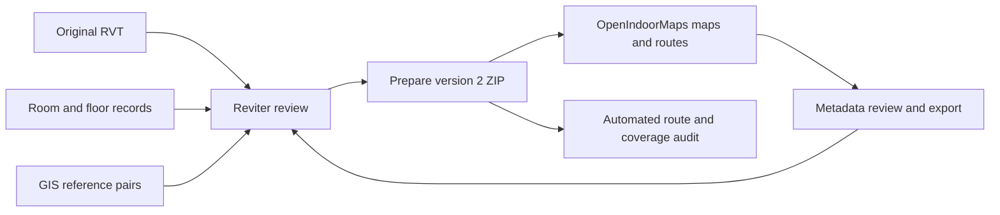

# Revit → reviewed indoor project → OpenIndoorMaps

This pipeline prepares a local, portable indoor project, opens it in OpenIndoorMaps, tests routes, saves metadata reviews, and regenerates the project after geometry corrections. It is suitable for review and development. A successful import does not mean every room or campus route is ready for public navigation.



## 1. Keep the three inputs together

For each model, retain:

1. The original RVT file, including its exact filename and Revit version.
2. The reviewed `reviter-room-annotations` JSON: source keys, room polygons and holes, room use, access, voids, doors, stairs, building transitions, campus storey groups, and drawing provenance.
3. WGS84 GIS reference pairs saved through Reviter. Model coordinates remain feet. Use at least two well-separated pairs; use a third independent point and points distributed across the campus to check alignment.

For a new model, a reviewed annotation JSON is an input prerequisite. This stage does not automatically create reliable room boundaries from any arbitrary RVT. Supply source records from a supported extraction/drawing workflow, register drawing walls when available, and review them in Reviter before preparing the project. Each active record needs a unique stable key, native `levelId`, model-feet polygon/holes and a consistent building identity. The existing directory resolves building identity from a `building-room` number prefix, then explicit `building`, then drawing section; normalize labels before import. Repeated room numbers are valid when their source keys differ.

Open the RVT and room JSON together in Reviter. Use **Floors → Building directory → Georeference model** to assign reference pairs. Save a project ZIP before preparing navigation. The ZIP preserves the original RVT bytes; it does not edit the source model.

If a newer room JSON has no georeference, the CLI below retains the exact references from the input ZIP. A different source-model filename is rejected. Do not substitute alignment from a different RVT revision without checking it.

## 2. Review geometry in Reviter

Before preparing a release, review each building and native level:

- Room/circulation polygons follow usable floor boundaries, including interior holes and open-to-below areas.
- Shared circulation classification identifies genuinely open areas. Preserve enclosed offices, storage, washrooms and staff restrictions.
- Doors identify their two source areas and have supported opening geometry. A reported relationship alone does not create a connection.
- Stair assemblies match actual lower and upper entrances. Local steps within a campus storey retain their native elevations; a whole stair room is not automatically a floor-to-floor connector.
- Inter-building doors and local-step transitions have supported entrances. An unassigned landing can become an explicit native landing surface when the saved transition verifies it.
- Group native levels into display storeys when appropriate. Grouping never creates graph links between coincident polygons.
- Review arrival points when drawing labels fall outside their polygons, on obstacles, or in a slab opening. Reviter's reviewed `routePointFeet` is separate from the original label.
- Inspect `sourceCoverage`: omitted drawing labels stay reported rather than being counted as imported areas.

Use the existing Reviter area, door, stair, boundary and picked-location tools for geometry corrections. Export the reviewed room JSON or project ZIP after changes.

## 3. Prepare a portable project

### Browser workflow

In **Floors → Building directory**, click **Prepare OpenIndoorMaps project**. At least two GIS pairs are required. A worker checks barriers, prepares navigation, exports a recovered GLB scene, and downloads a version 2 `.reviter.zip`.

**Export project ZIP** remains the lighter archive-only operation. Version 1 archives can reopen in Reviter, but must be prepared before OpenIndoorMaps can route them.

### Repeatable CLI workflow

Run from the Reviter repository with Node 22.13 or newer:

```sh
npm ci
npm run indoor:prepare -- \
  --input /absolute/path/source.reviter.zip \
  --rooms /absolute/path/latest-room-reviews.json \
  --out /absolute/path/prepared.reviter.zip \
  --revit-version 2027
```

`--rooms` is optional: without it, the saved package reviews are used. `--revit-version` is optional: without it, the converter uses its normal version detection. `--no-scene` produces a smaller map/routing project with no GLB. The CLI writes a separate `<output>.report.json` containing provenance, alignment, floor groups, coverage and review issues. Unsupported or insufficient native geometry causes preparation to fail rather than generating guessed connections.

For the current UNBC source, the command used was:

```sh
npm run indoor:prepare -- \
  --input '/Users/ahmadjalil/Downloads/UNBC Model - 2026-06-30 - FINAL (Fixed Library) (1).reviter.zip' \
  --rooms '/Users/ahmadjalil/Downloads/rooms.public-circulation-reviewed.json' \
  --out work/indoor-pipeline/UNBC.prepared.reviter.zip \
  --revit-version 2027
```

The source archive and review JSON are unchanged. The newer JSON is merged with the archive's two exact GIS pairs. No synthetic survey point is added.

## 4. Open and test in OpenIndoorMaps

From the OpenIndoorMaps repository:

```sh
npm ci
npm run dev -- --port 5174 --strictPort
```

Open **Prepared indoor projects** under **Revit Imports** on the welcome screen, or go directly to `http://localhost:5174/projects/indoor`, then click **Import project ZIP**. Import the prepared ZIP, not the RVT alone. The importer verifies all manifest sizes and SHA-256 digests, source binding, GIS agreement, and graph identities before use. The existing static venue maps retain their own datasets.

1. Select a campus floor, then **All buildings** or one building.
2. Use **Whole floor** to reset framing. Scroll/drag and the map controls provide normal map navigation.
3. **Circulation only · retain outlines** hides non-circulation fill while retaining source outlines and architectural walls. **Show routing network** draws the prepared walk graph.
4. Click an area or search by room number/name. The inspector shows its source key, building, native level, surface height, slab evidence, arrival status and preserved model relationships.
5. Select **Use as start / destination**, or use the route dropdowns. **Fit route** frames the result. Floor buttons show each campus storey visited by the route.
6. Click a door/stair marker or an instruction entry to inspect native identity, source evidence, endpoint areas and levels. Unmatched doors remain in the review queue; they do not become routing edges.
7. Toggle **Native 3D floor section** to see the recovered model and reviewed room/circulation colors on the same GIS alignment. The selected storey's lowest floor surface is the display datum. Source vertical feet and split elevations are retained; no surveyed absolute altitude or terrain model is assigned.
8. Test **Public review · exclude staff** and **Step-free · confirmed edges only**. A failed route is useful evidence; inspect its entrances and source boundaries.

Browser storage restores the most recently imported/exported project at the same origin. Unsaved reviews remain in memory until export. Storage failure is reported; the downloaded ZIP is the portable backup.

## 5. Assign metadata and preserve reviews

| Review | Where to assign it | Effect |
| --- | --- | --- |
| Display name and review notes | OpenIndoorMaps area inspector | Keeps the original source label and geometry; saves a presentation override |
| Public / staff / unknown access | Area inspector | Recalculates routes immediately; staff areas are excluded |
| Block an area as a void/unwalkable | Area inspector | Removes it from route use; restoring previously blocked geometry requires regeneration |
| Close or disable a supported connection | Connection inspector | Recalculates routes immediately |
| Confirm step-free passage | Connection inspector | Makes a supported non-step edge eligible for step-free routing; check clearance, thresholds and access |
| Arrival point, polygons/holes, area use, door sides, native stair entrances, local steps, building transitions | Reviter's review tools and source JSON | Requires preparation again; never creates an unvalidated shortcut in OpenIndoorMaps |
| New elevator/ramp or an entrance with missing native evidence | Source model/review workflow and compiler extension | Not inferred automatically by the current stair/door pipeline |

Click **Apply review**, then **Export reviewed project**, then the visible **Download reviewed ZIP** link. Preparing the ZIP also saves it in this browser. The download includes the original RVT, GIS pairs, source JSON, metadata overrides, prepared map/graph and optional GLB. Floor and graph hashes are regenerated. Import that ZIP again to verify the result. The link remains available until another review/import or page reload; if it disappears, export again.

For geometry corrections, open the reviewed ZIP in Reviter, fix the source records/entrances, then prepare it again. The CLI can also take the reviewed ZIP directly. Display-name overrides do not change circulation classification. Accessibility confirmations are tied to the exact model digest and endpoint geometry; changed geometry requires rechecking them. Steps cannot be marked step-free.

## 6. Automated validation for another model

Reviter checks:

```sh
node --experimental-strip-types --test \
  tests/indoor-grid.test.ts tests/indoor-pipeline.test.ts \
  tests/project-package.test.ts tests/georeference.test.ts \
  tests/room-directory.test.ts tests/directory-navigation.test.ts \
  tests/directory-openings.test.ts
npx tsc --project tsconfig.indoor-pipeline.json
npm run build:pages
```

OpenIndoorMaps checks:

```sh
npm run test:indoor
npx tsc --project tsconfig.indoor-project.json
npm run build
npm run indoor:audit -- /absolute/path/prepared.reviter.zip \
  --cases /absolute/path/route-cases.json \
  --out /absolute/path/validation.json
```

Route cases are data, not hard-coded building logic:

```json
[
  {"name":"Known public connection",
   "start":{"number":"A-101","levelId":100},
   "end":{"number":"B-102","levelId":100},"expect":"route"},
  {"name":"Known void is blocked",
   "start":{"key":"stable-source-start"},
   "end":{"key":"stable-source-void"},"expect":"blocked"},
  {"name":"Entrance under review",
   "start":{"number":"A-103","levelId":100},
   "end":{"number":"A-104","levelId":100},"expect":"review"}
]
```

`route` and `blocked` cases fail the command when expectations are violated. `review` cases record current behavior without turning an unresolved connection into an accepted route. Omitting `--cases` runs structural/registration checks and a supported-route restriction round-trip when such a pair exists. Use source keys where room numbers are duplicated. The current UNBC cases are in OpenIndoorMaps `tests/fixtures/unbc-indoor-routes.json`.

Tests cover thin native walls, holes, staff masks, precise openings, stable IDs, coincident floors, room shortcut prevention, step-free confirmation, stale accessibility reviews, package damage and model/GIS preservation across export/import. For release, also walk representative routes in the real building and review access, clearances and the GIS registration independently.

## 7. Package and graph contract

Version 2 is additive to the version 1 archive:

```text
manifest.json                 version, createdAt, entry paths/sizes/SHA-256
model/<original filename>     unchanged RVT/RFA/RTE/RFT bytes
floors/rooms.json              complete source records/reviews/provenance
gis/reference-points.json     exact saved WGS84 reference pairs
viewer/indoor.json            prepared floor catalog, areas, graph and report
model/scene.glb               optional recovered 3D scene
```

Entry names are allowlisted; duplicate, unlisted and oversized entries are rejected. Limits: source 512 MiB, room JSON 64 MiB, GIS 1 MiB, indoor data 128 MiB, GLB 256 MiB, whole ZIP/expanded content 900 MiB. Map tiles and separate Reviter camera/comment/markup sidecars are outside the package.

`reviter-indoor` version 1 contains:

- Source filename and model/room digests.
- Model-origin feet, WGS84 origin, projection latitude, rotation, horizontal metres/foot and independent vertical conversion of 0.3048 metres/foot.
- Display floor groups plus unchanged native levels.
- Source-keyed area records, polygon rings, elevation evidence, access/use and arrival IDs.
- Nodes identified by strings and by building/native level/surface. Shared XY coordinates cannot implicitly join them.
- Edges for walks, precise doors/registered openings, matched stairs and native-supported local steps. Evidence, native ID, room masks, enabled status and accessibility are retained.
- Architectural footprints and a review/coverage report.

The compiler uses a four-neighbour 0.6 ft raster and tests complete movement segments against native walls, columns and floor-opening masks. Private rooms override overlapping circulation. Degree-two cells are compressed at actual grid bends. A BFS forest connects supported terminals in each circulation surface/room; Dijkstra finds the shortest path in that exported graph. The forest can introduce detours compared with a full navigation mesh. It is an explicit first implementation, not a globally optimal geometric pathfinder. Ordinary rooms cannot serve as shortcuts unless they are the chosen start/destination; stair areas can carry verified stair connections.

Public review routing excludes explicit staff/voids but allows unknown access with visible warnings. Step-free routing accepts only edges explicitly confirmed step-free. There is no automatic elevator inference, clearance certification, live door position, opening-hours enforcement, emergency routing or guarantee of complete campus coverage.

The schema is `lib/reviter/indoor-contract.ts` in Reviter and its consumer copy `app/indoor-project/contract.ts` in OpenIndoorMaps. Keep them synchronized when changing the contract and version migrations. Browser and CLI use the same compiler; existing OpenIndoorMaps venue routing is independent.

## 8. UNBC evidence and remaining source work

The current prepared example includes all 1,860 source/recovered records, two saved GIS pairs and the original RVT (SHA-256 `8c294549ee667ed7aba38f1f4f3a53514dae7544af97f0157ee8187dd8702178`). GIS fit RMS is about 0.14 m; two fitted points are not an independent survey accuracy check.

The initial graph has 5,730 nodes, 5,459 edges, 1,610 arrivals with graph connections, 137 components and 419 arrivals in the largest component. An arrival connected inside its room can still be disconnected from the campus network. Edge counts: 3,999 walk branches, 1,428 doors, four registered openings, 26 stairs, and two supported local-step transitions. There are 411 unmatched native doors and 360 omitted source labels.

Verified pilot behavior:

| Case | Result |
| --- | --- |
| 05-120, Library → 07-101, Agora, native level #311 | Route, approximately 20.8 m |
| 05-S101 #311 → 05-S201 #694 | Native stair route, approximately 5.4 m |
| 08-S101 #1487816 → 08-S201 #694 | Native stair route, approximately 8.8 m |
| 04-124 → 04-445 upper Rotunda void | Blocked |
| Staff restriction, export and reimport | Route remains blocked; model/GIS preserved |
| Map registration vs exported node coordinates | Agreement within floating-point precision |

05-142 → 07-203A, 07-180 → 08-155 and 07-203 → 09-214 remain review cases: native local transitions alone do not repair every adjoining source boundary/arrival. Resolve their missing entrances and polygons in Reviter before claiming continuous routes. Do not release the whole campus as fully connected on the strength of the small pilot.

Generated artifacts are in Reviter `work/indoor-pipeline/`: the prepared ZIP, preparation log, report, cross-app validation JSON, and interface screenshots. The audit reports coverage for every imported building/native-level pair. The [published validation snapshot](indoor-pipeline/unbc-validation.json) and screenshots under `docs/indoor-pipeline/` preserve the demonstrated evidence in the repository. Large RVT/ZIP files are local artifacts, not repository assets.

## 9. Demonstrated interface and handoff

The current example is also saved as `/Users/ahmadjalil/Downloads/UNBC.indoor.prepared.reviter.zip`. Start OpenIndoorMaps on port 5174 and open `/projects/indoor`. Import that file if browser storage is empty.

The browser walkthrough verified campus Floor 1, the 05-120 → 07-101 route and native Door #868723 inspector, the 05-S101 → 05-S201 route and Floor 2 button, and the native 3D floor section. A connection review note survived export to browser storage and reopening. Package export/import and staff restriction preservation were separately verified with the same package code against the full UNBC archive. The in-app browser automation did not return a disk-download event for the ZIP link, so an automated disk-download/reupload in that browser was not verified; the CLI-generated portable example is available at the path above.


The selected checks passed: 44 Reviter tests, eight OpenIndoorMaps tests, scoped TypeScript checks for both integrations, both production builds and the static Pages worker check. A full OpenIndoorMaps TypeScript run remains affected by existing optional-padding errors in `scripts/verify-bc-hospital-step-follow.ts`; it is not reported as a clean whole-repository check.

The subsequent Reviter pre-push check on October 1, 2026 passed the full unit suite (1,283 passed, one skipped), production build, four server-rendered interface checks, scoped pipeline TypeScript check, and static Pages build/worker check. The browser ZIP size preflight uses the same 900 MiB package limit as the parser.

For another building/model, repeat sections 1–6, supply that project's own route-case JSON, and retain its report alongside the prepared ZIP. Accept a navigation release only after resolving the relevant coverage gaps, verifying representative routes on site, confirming access/step-free metadata, and checking registration with an independent reference point. The 3D section is visual review context; use the 2D floor route for the current route display.
